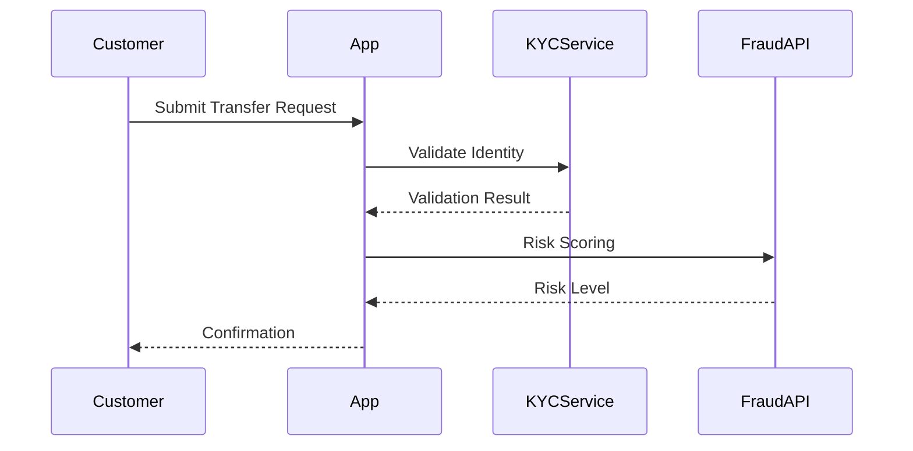

# Business Requirements Document Template

---

## Required BRD Structure

All BRDs must follow this structure and section order:

---

### 1. Feature Overview

* A plain English summary of what the feature enables from a business standpoint.
* Should answer: **What problem does this solve? Who benefits?**

**Example:**

> This feature enables registered users to request a statement of all wire transfers made in the last 12 months. It improves self-service transparency and reduces call center load.

---

### 2. Functional Requirements

* Describe **what the system must do** in terms of **business behavior**.
* Use simple, active statements (e.g., "The system must notify the customer...")
* Group similar requirements under subheadings if needed (e.g., "Data Entry", "Review and Approval")

**Format Example:**

* The system must display a list of past wire transfers filtered by date.
* Users must be able to download transfer details as PDF.
* If no records are found, the system must display a "No transfers found" message.

---

### 3. Business Validations or Rules

* Capture **all logic constraints**, typically enforced via conditional checks in code.
* Explain **what is allowed, required, or blocked**, in business terms.

**Format Example:**

* Transfer amount must be less than $50,000 unless user has verified identity.
* Transfer can only be initiated between 6:00 AM and 10:00 PM local time.
* Users with "suspended" status cannot initiate transfers.

---

### 4. Actors and System Interactions

* List **all user roles or systems** that interact with this functionality.
* Use friendly, business-facing terms like "Customer," "Back Office User," "KYC API," etc.

**Format Example:**

| Actor               | Role in Process                           |
| ------------------- | ----------------------------------------- |
| Customer            | Initiates the transfer request            |
| Fraud Detection API | Performs real-time risk analysis          |
| Agent               | Approves flagged transfers over threshold |

---

### 5. Business Process Flow

* Describe **step-by-step how the feature works** from initiation to resolution.
* Use numbered lists for linear flows and "if...then..." for conditionals.

**Example:**

1. Customer logs in and selects "Transfer Funds."
2. System displays transfer form.
3. Customer enters amount, recipient, and purpose.
4. If amount > $10,000, system triggers enhanced validation.
5. Upon confirmation, system creates the transfer request and sends a notification.

---

### 6. Sequence Diagram (Optional but Recommended)

* Use **Mermaid** or **PlantUML** to visualize component-level interactions.
* Focus on **business-relevant systems and flow**, not technical layers.

**Mermaid Example:**

---

### 7. Assumptions and Constraints

* State **conditions assumed by the system** and **any limitations**.
* Helps developers and testers align with edge-case behavior.

**Examples:**

* Assumes customer is already registered and KYC-approved.
* Applies only to domestic transfers; cross-border excluded.
* Does not apply to mobile app users (web only).

---

### 8. Acceptance Criteria

* List **business-facing pass/fail conditions** for the feature to be considered complete.
* Make them measurable and actionable.

**Example:**

* Users must receive email confirmation within 1 minute of submission.
* High-risk transfers must trigger manual review 100% of the time.
* "No results found" page must include retry option.
