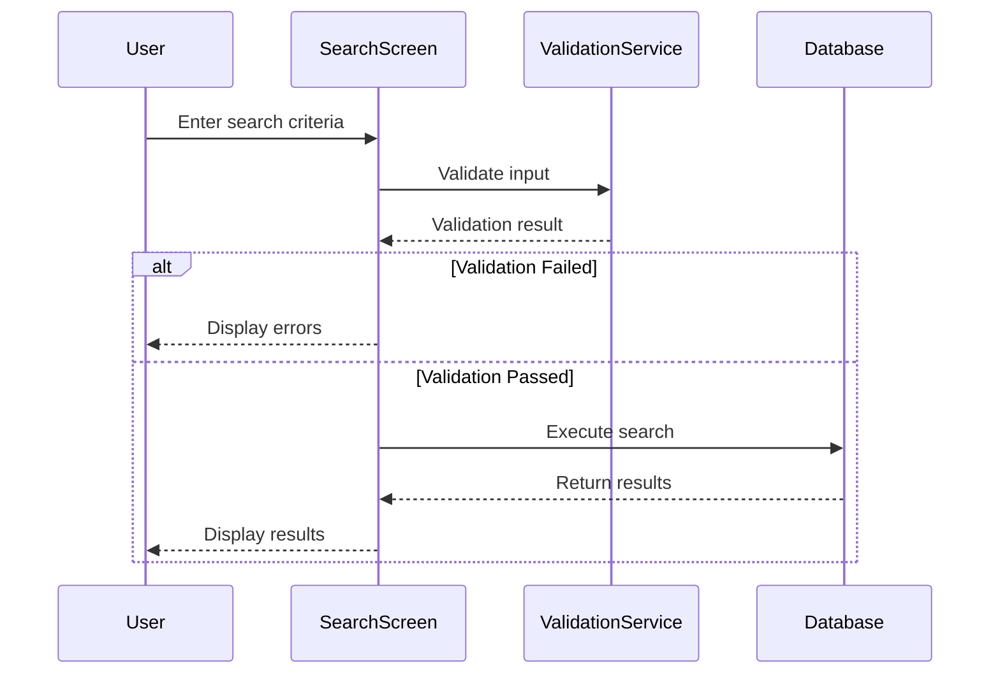

# Business Requirements Document Template

---

## Required BRD Structure

All BRDs must follow this structure and section order. Focus on **business behavior and outcomes**, not technical implementation details.

---

### 1. Feature Overview

A plain English summary of what the feature enables from a business standpoint.

**Should answer:**
- What problem does this solve?
- Who benefits from this feature?
- What are the key capabilities?
- How does it fit into broader business processes?

**Example:**

> The Legal Entity Search feature enables authorized users to quickly locate legal entity records within the system using flexible search criteria. This feature solves the critical business problem of rapid information retrieval when users need to access legal entity details for customer inquiries, establish business relationships, perform record maintenance, or complete transactions.

---

### 1.1 Sub-Features and Screens

List all sub-features (screens) that are part of this main feature.

**Format as a table:**

| Sub-Feature | Screen Type | URL Pattern | Description |
|-------------|-------------|-------------|-------------|
| POI Info | Maintenance | /flow/point-info | Point of Interest information maintenance |
| POI Survey | Entry | /flow/poi-survey | Survey data entry for points |
| POI Status History | Inquiry | /flow/poi-status | View historical status changes |

**For each sub-feature, include:**
- Action class and methods
- JSP pages
- Navigation transitions

**Example:**

**POI Info (Maintenance Screen)**
- **Action Class:** `PointInfoMaintenanceAction`
- **Methods:** `saveInfoMaintenance`, `lookupPointSubType`, `emailInfoMaintenance`
- **JSPs:** `pointInfoMaint.jsp`, `pointInfoResults.jsp`
- **Transitions to:** POI Survey, POI Status History

---

### 2. Functional Requirements

Describe **what the system must do** in terms of **business behavior**.

**Guidelines:**
- Use simple, active statements (e.g., "The system must...", "Users must be able to...")
- Group similar requirements under subheadings (e.g., "Core Search Capabilities", "Results Display", "User Experience")
- Be specific and deterministic

**Format Example:**

**Core Capabilities**
- The system must provide search by name, allowing partial matches.
- Users must be able to filter results to show only active records.

**Results Display**
- The system must display results in a sortable table format.
- If no records are found, the system must display an appropriate message.

---

### 3. Business Validations and Rules

Capture **all logic constraints and business rules** in plain business terms.

**Organize by category:**
- **Input Validation Rules**: Field requirements, formats, ranges
- **Processing Rules**: How the system handles data
- **Status/Filtering Rules**: Inclusion/exclusion conditions
- **Result Management Rules**: Limits, sorting, pagination

**Format Example:**

- Transfer amount must be less than $50,000 unless user has verified identity.
- Users with "suspended" status cannot initiate transfers.
- When results exceed the maximum limit, the system must display a warning and reduce the result set.

---

### 3.1 Validation Chains

Document the complete validation flow from user action to database persistence.

**Validation Chain Format:**

```
[Screen Action] → [Service Validator] → [Entity Constraints] → [Database]
```

**Example - Save Point Info:**

| Step | Layer | Class/Method | Validations |
|------|-------|--------------|-------------|
| 1 | Action | `PointInfoAction.save()` | Null check for point ID, permission validation |
| 2 | Validator | `PointValidator.validate()` | Required fields, format validation |
| 3 | Service | `PointService.savePoint()` | Business rule validation, duplicate check |
| 4 | Entity | `PointEntity` | @NotNull, @Size constraints |

**Validated Fields:**
- `pointId` - Required, must be unique
- `pointName` - Required, max 100 characters
- `effectiveDate` - Required, must be future date

---

### 4. Actors and System Interactions

List **all user roles and systems** that interact with this functionality.

**Format as a table:**

| Actor / System      | Role in Process                           |
| ------------------- | ----------------------------------------- |
| Customer            | Initiates the request                     |
| Validation Service  | Performs real-time validation             |
| Agent               | Approves flagged requests over threshold  |
| Database            | Stores and retrieves records              |

Include both human actors AND system components. Briefly explain each role.

---

### 5. Business Process Flow

Describe **step-by-step how the feature works** from initiation to resolution.

**Guidelines:**
- Use numbered lists for sequential steps
- Use "if...then..." for conditional logic
- Document multiple modes/paths separately if applicable

**Example:**

**Standard Flow**
1. User navigates to the search screen.
2. System displays search form with default settings.
3. User enters search criteria and clicks Search.
4. System validates the input.
5. If validation fails, system displays error messages.
6. If validation succeeds, system executes the search.
7. System displays results in a sortable table.
8. User selects a record to view details.

---

### 6. Sequence Diagram

Use **Mermaid** syntax to visualize interactions between actors and systems.

**Guidelines:**
- Focus on **business-relevant** interactions
- Show key decision points with alt blocks
- Keep it readable - don't include every technical detail

**Example:**



---

### 7. Assumptions and Constraints

Document **conditions assumed** and **limitations** of the feature.

**Assumptions:**
- What must be true for the feature to work correctly?
- Authentication/authorization assumptions
- Data integrity assumptions

**Constraints:**
- Input limits (field lengths, numeric ranges)
- Result set limits
- Feature scope boundaries (what's NOT included)
- Platform/channel constraints

**Examples:**

- Assumes user is already authenticated and authorized.
- Applies only to domestic transactions; cross-border excluded.
- Maximum 40 characters for name search fields.
- Does not apply to mobile app users (web only).

---

### 7.1 Cross-Feature Dependencies

Document how this feature interacts with and depends on other features.

**Shared Entities:**
List entities that are used by multiple features.

| Entity | Used By Features | Impact |
|--------|------------------|--------|
| PointEntity | Point Maintenance, Legal Entity Search | Changes may affect both features |
| ContactEntity | Point Maintenance, Contact Management | Shared contact data |

**Shared Services:**
List services that are used by multiple features.

| Service | Used By Features | Purpose |
|---------|------------------|---------|
| ValidationService | Point Maintenance, Meter Station | Common validation logic |
| AuditService | All features | Audit trail logging |

**Cascade Effects:**
Document cascading effects when data changes.

| Source | Target | Cascade Type | Business Impact |
|--------|--------|--------------|-----------------|
| PointEntity | MeterStation | ON DELETE CASCADE | Deleting a point removes associated meter stations |
| LegalEntity | Contact | ON UPDATE CASCADE | Legal entity changes propagate to contacts |

**Feature Impact Analysis:**
When modifying this feature, these related features may be affected:
- [List dependent features]
- [List upstream features]

---

### 8. Acceptance Criteria

List **business-facing pass/fail conditions** for the feature to be considered complete.

**Guidelines:**
- Make criteria measurable and testable
- Organize by functional area
- Format: "When [action], the system must [expected behavior]"

**Example:**

**Search Functionality**
- When user enters "NAT" in name search, the system must return all entities whose names start with "NAT" (case-insensitive).
- When user specifies a number range 1000-2000, the system must return all entities with numbers in that range inclusive.

**Validation**
- When required fields are empty, the system must display validation errors and prevent search execution.

**Results Display**
- When results exceed the maximum limit, the system must display a warning message.
- Search results must be sortable by clicking any column header.
